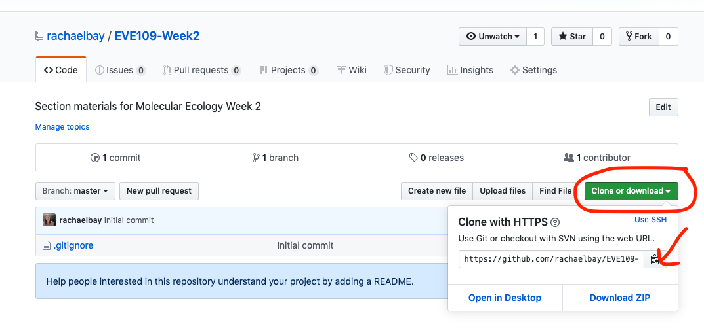
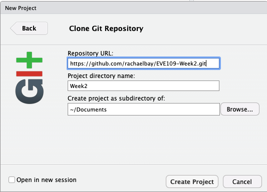

EVE 109 Section Week 2
================

### 1. Getting data from github

For this course, all the information and data we need will be stored in github. You saw github last week when we accessed the first tutorial. We can also use github to share and download data so that we are all working with the same files. A collection of files and scripts on github is called a *repository*. Each week we will download a new repository with the files needed for that week. Right now, you are looking at the webpage for the week 2 repository. Notice the URL is <http://github.com/rachaelbay/EVE109-Week2>. Each week, you can replace the "Week2" with the current week for the section tutorial and homework assignments.

First, we need to copy the repository to our own computer. This is called *cloning*. We can easily do this by clicking the green button that says "Clone or download", then clicking the clipboard button to copy the URL: 

We can download this repository onto our computer by creating an R Project:
1. In RStudio, click *File* then *New Project*.
2. On the next screen, click *Version control*.
3. On the next screen, click *Git*.
4. Paste in the URL you copied, and name the project. You should also tell it where to save these files using the *Browse* button so that you can come back to them later. For example, the following screen shows me saving the repository to the "Documents" on my computer: 

 

Once you click "Create Project" the files will download from github (you must be connected to the internet!) and you will have everything you need for this week's section and homework.

Note: Where did you download the data on your computer? A common mistake is to lose track of your downloads. Navigate to the location where you downloaded the repository. There should be a folder inside called "data". Each week, this folder will contain data needed for the week's homework. You should see a spreadsheet called "wombats.csv". Open it in a spreadsheet program (Excel or Numbers).  

Put up your green card when you have done this

     

### 2. Reading in data from spreadsheets

A lot of data we use is stored in spreadsheets. However, when we store them in a normal Excel format (.xlsx) they come with a lot of extra formatting that R has trouble reading. One way to avoid this is to store them in a comma separated value format (.csv). Open "wombats.csv" in a text editor and look at it. It's not easy for us to read, but you can see that it is a very simple format where each entry is separated by a comma. You were able to open it in a spreadsheet program and R can read it easily. If you are making your own data, you can save spreadsheets as .csv files from most spreadsheet programs.

Now we want to read that data into RStudio. We can do that using the command `read.csv`. Remember do assign the resulting data frame to an object:

``` r
data <- read.csv("data/wombats.csv") # Read in a file
```

Remember, we can look at the top of the dataframe using `head`:

``` r
head(data)
```

    ##   No.captures total males females
    ## 1           1    25    18       7
    ## 2           2    11     7       4
    ## 3           3    10     7       3
    ## 4           4    10     6       4
    ## 5           5     9     6       3
    ## 6           6    11     6       5

This is data from the paper we read this week by Banks et al. (2003) using genetic analysis to monitor northern hairy-nosed wombats. The table represents the data shown in Figure 1, so individuals have already been identified and we're looking at the number of times each was recaptured.

     

### 3. Simple capture recapture example

Next we will learn a simple way to make population size estimations. We will use the `capwire` package to do this. Remember how to install and load a package?

``` r
install.packages("capwire")
```

``` r
library(capwire)
```

The manual for capwire can be found online [here](https://cran.r-project.org/web/packages/capwire/capwire.pdf)

 

Okay, now lets make up some data. Luckily, *capwire* has a function that allows you to simulate data. Look up the function `simCapture`. Notice there are three different arguments we need to specify (we can ignore *return.cap.probs* because it has a default that we do not want to change). Using this function we'll simulate a population of 300, from which we have 50 samples. This distribution function just means that every individual has an equal probability of being captured.

``` r
sim <- simCapture(n=300,s=50,dist.func=drawCapRatesUnif(0.1,1))
sim
```

    ##   capture.class No.Ind
    ## 1             1     42
    ## 2             2      4

Now that we have simulated data, we can use one of the `fitEcm` function to estimate population size. What arguments do we need for that function? Notice that the help page tells you what format your data should be in.

``` r
ecm <- fitEcm(data=sim,max.pop=300)
```

The `fitEcm` page also describes that output. We are most interested in the population size estimate, which is called `ml.pop.size`. We can extract that using:

``` r
ecm$ml.pop.size
```

    ## [1] 290

How much uncertainty is there in our estimate? We can use bootstrap resampling to create confidence intervals. Look up the command `boostrapCapwire`

``` r
boot <- bootstrapCapwire(x=ecm,bootstraps=1000,CI=c(0.025,0.975))
boot
```

    ## $ml.pop.size
    ## [1] 290
    ## 
    ## $conf.int
    ##  2.5% 97.5% 
    ##   136   300

Using this 95% confidence interval means there is a 95% chance the real answer is within that range.

     

Homework
========

Now that we know how to estimate population sizes, we will use the wombat data from before. Start a new script for this.

### *Homework 2: Write a script that does the following:*

#### 1. Read in "wombats.csv"

#### 2. Estimate the total population size.

#### 3. Estimate confidence intervals for the total population size.

#### 4. Estimate male and female population sizes.

#### 5. What is the ratio of males to females in this population?
